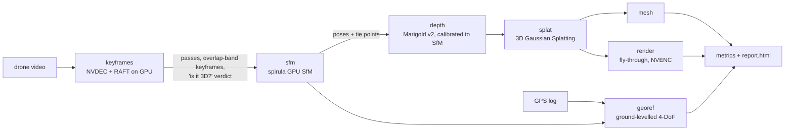

# Single-Pass Drone Video → 3D, on one GPU

[](LICENSE)
[](.python-version)
[](https://docs.astral.sh/uv/)
[](docs/problem-statement.md)

One drone video in: a **3D Gaussian Splatting model**, a **textured mesh**, camera
poses, calibrated **depth maps** and — when a flight log is supplied —
**georeferenced, metric** outputs. Built for Smart India Hackathon problem
statement **26158** (NTRO): an accurate 3D model from a *single pass*, no flight
planning, no ground control.

Everything between the video and the model runs on the GPU: NVDEC decoding,
RAFT optical flow, spirula-studio's GPU structure from motion and splat trainer,
and the Marigold v2 diffusion-transformer depth prior.

## How it works



1. **Passes.** Edited footage is several camera moves; a cut, fade or dissolve
   collapses forward–backward optical-flow consistency between neighbouring
   frames. Letterbox bars are detected and cropped, fade-ins and fade-outs
   trimmed.
2. **Keyframes by overlap, not by clock.** A grid of points is chained through
   the optical flow from keyframe *K*; the next keyframe is the sharpest frame
   whose co-visibility with *K* lies in the band [τ, τ+δ] (default 0.75–0.85) —
   similar enough to match, different enough to triangulate. Each surface point
   is seen by about 1/(1−τ) keyframes.
3. **Is it really 3D?** Before any reconstruction, each pass is tested for
   parallax: residual motion after the best homography, measured with *direct*
   keyframe-pair flow and normalised by an estimated noise floor (SNR 1 = no
   parallax). A drone yawing on the spot, a planar or far-away scene is flagged
   `degenerate` instead of producing a broken model.
4. **Structure from motion** (spirula-studio, GPU): one camera per pass with a
   single focal length (square pixels), each pass a video sequence.
5. **Depth prior**: Marigold v2 (Qwen-Image-Edit DiT, NF4) predicts affine-invariant
   log depth; a per-image **monotone** calibration against the SfM tie points
   turns it into consistent depth and scores it on held-out points. Where the
   prior saturates (distant, textureless far field) the stage writes nothing
   rather than wrong supervision.
6. **3D Gaussian Splatting** per SfM model, depth-supervised, with every 8th
   keyframe held out for evaluation; **meshes** extracted from the splats.
7. **Georeferencing**: a single pass is a near-straight line, so aligning camera
   centres to GPS leaves the roll about it undetermined; the model is levelled on
   its RANSAC ground plane and only yaw, scale and translation are fitted (the
   full similarity only when GPS proves the ground is sloped). Leave-one-out
   error and a jackknife scale uncertainty are reported.

The full method, experiments and limitations are in [`paper/main.pdf`](paper/)
(built from [`paper/main.tex`](paper/main.tex); tables generated from the run
JSON by [`experiments/make_paper.py`](experiments/make_paper.py)).

## Results so far

Jal Mahal, Jaipur (55 s of 4K drone cinematics, `outputs/jal_mahal`):

| Stage | Result |
|---|---|
| Passes | 5 camera moves found in the edit; all judged 3D (parallax SNR 3.2–22.4) |
| Keyframes | 213, mean co-visibility 0.74–0.86 with the previous keyframe, ~7 views per point |
| SfM | **213 / 213** keyframes registered in 4 models, 0.79 px mean reprojection |
| Depth prior | held-out AbsRel vs SfM **2.7 %** (palace approach), 0.6 % (nadir rooftop), 3.3 % (orbit); the far-field lake pass is withheld |
| Negative control | synthetic pure-rotation clip: SNR 1.24 → `degenerate` |
| Georeferencing (simulation) | straight pass, 3 m GPS noise: 0.9 m error 100 m off-track vs 221 m for the plain 7-DoF fit; scale error ≤ 0.6 % |

Splat quality (held-out PSNR/SSIM), mesh statistics and per-stage GPU
utilisation are written to `outputs/<run>/metrics/metrics.json` and the paper.

## Quickstart

Requires an NVIDIA GPU (tested on A100 80 GB, driver 610 / CUDA 13.x), `uv`,
Node ≥ 18 (promo film only) and a C++17 compiler.

```bash
git clone --recurse-submodules https://github.com/Shuvam-Banerji-Seal/SIH_2D-to-3D
cd SIH_2D-to-3D
uv sync --all-extras                       # Python 3.14, torch 2.14 + CUDA 13.2

# spirula-studio (GPU SfM + 3DGS), headless Vulkan build
bash third_party/spirula-studio/build_develop.bash \
     -DSS_BACKEND=vulkan -DSS_BUILD_GUI=OFF -DCMAKE_BUILD_TYPE=Release \
     "-DCMAKE_CXX_FLAGS=-include cstddef"  # the flag is only needed with GCC 11

# Marigold v2 + Qwen-Image-Edit base (~56 GB; the text encoder is not needed)
export DEPTH_ASSETS_DIR=/store/huggingface/marigold-v2
uvx --from 'huggingface_hub[hf_xet]' hf download huawei-bayerlab/marigold-v2-0 \
     --local-dir $DEPTH_ASSETS_DIR/checkpoints/Marigold-V2
uvx --from 'huggingface_hub[hf_xet]' hf download Qwen/Qwen-Image-Edit-2509 \
     --local-dir $DEPTH_ASSETS_DIR/checkpoints/Qwen-Image-Edit-2509 --exclude 'text_encoder/*'

# a static ffmpeg >= 5 with NVDEC is picked up from .tools/ffmpeg (or $DRONE3D_FFMPEG)
uv run drone3d doctor                      # checks every piece above
```

Run one video end to end:

```bash
CUDA_HOME=/usr/local/cuda-13.3 uv run drone3d run \
    --set ingest.video=datasets/clip.webm \
    --set ingest.telemetry=flight.srt       # optional: enables georeferencing
```

Profiles: `configs/fast.yaml` (minutes: small flow model, no depth prior, 7k
steps), `configs/default.yaml`, `configs/accurate.yaml` (denser keyframes,
full-resolution training). Any key can be overridden with `--set section.key=value`;
any stage re-run on an existing run directory with `--run-dir R --stages splat,mesh`.

Sample footage: `tools/fetch_datasets.sh` downloads the fifteen public clips listed
in [`resources.md`](resources.md) (they carry no flight logs).

## Outputs

```
outputs/<run>/
├── dataset/images/pass_NN/f_XXXXXX.jpg   keyframes (4K, letterbox cropped)
├── dataset/sparse/N/                     COLMAP models, one per reconstructable pass
├── dataset/depths/…png                   calibrated depth (spirula 16-bit format)
├── splats/model_N/                       3DGS model (splat.ply), held-out renders, mesh.{ply,obj,glb}
├── georef/                               ENU clouds, camera_track.geojson (with telemetry)
├── render/*_flythrough.mp4               NVENC fly-through videos
├── keyframes/keyframe_timeline.png       passes, overlap and verdicts along the video
├── */result.json, */gpu_timeline.json    per-stage results and GPU telemetry
├── metrics/metrics.json, report.html, manifest.json
```

## Repository

```
src/drone3d/
├── io/nvdec.py         NVDEC decode, GPU colour conversion, letterbox detection, nvJPEG extraction
├── io/telemetry.py     CSV / DJI SRT / GPX / JSON flight logs
├── keyframes/          RAFT flow (CUDA Graphs), pass segmentation, overlap-band selection, 3D verdict
├── depth/              Marigold v2 wrapper, SfM calibration (affine + monotone), depth stage
├── splat/              spirula-studio sfm/train/mesh wrappers, gsplat fly-through renderer
├── geo/                WGS84/ENU, Umeyama, ground-levelled 4-DoF georeferencing
├── gpu/monitor.py      NVML utilisation / power / memory sampler (records GPU sharing)
├── report/             HTML report, figures
├── pipeline.py, config.py, cli.py
experiments/            scripts that regenerate every number and figure in the paper
paper/                  LaTeX paper (main.tex, generated/, figures/)
promo/                  code-drawn promo film (javascript-animation skill) + compositor
third_party/            spirula-studio, marigold-v2, javascript-animation-skills (submodules)
tools/                  dataset download, synthetic control clip
```

## Licences

This repository is GPL-2.0-only. spirula-studio (GPL-3.0) is used as a separate
program, invoked through its command line; Marigold v2 weights are Apache-2.0 and
build on Qwen-Image-Edit-2509 (its own licence); the sample videos are third-party
YouTube content used for research only and are not redistributed.
