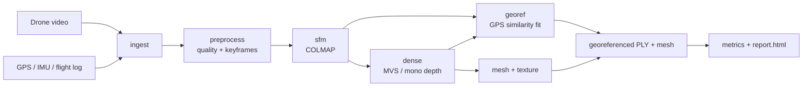

# Single-Pass Drone Video → 3D

[](https://github.com/Shuvam-Banerji-Seal/SIH_2D-to-3D/actions/workflows/ci.yml)
[](LICENSE)
[](pyproject.toml)
[](https://docs.astral.sh/uv/)
[](docs/problem-statement.md)

AI-enabled pipeline that turns a **single-pass drone video** into a
**georeferenced, metrically accurate, textured 3D model** — no multi-pass
flight planning, no extensive ground control. Built for Smart India Hackathon
problem statement **26158** (National Technical Research Organisation).

> One flight path in → terrain, buildings, roads, vegetation and textured meshes out.

## What it does

| PS deliverable | How this repo addresses it |
| --- | --- |
| 3D terrain & structures | COLMAP SfM + dense MVS, artifact-based stages |
| Building facades & rooftops | Texture mapping, Poisson surface, monocular depth completion |
| Roads & infrastructure | Keyframe quality ranking keeps low-texture surfaces usable |
| Vegetation & obstacles | Motion/YOLO dynamic masking, dense reconstruction |
| Textured meshes / point clouds | PLY, OBJ + textures, glTF export via optional Open3D/Trimesh |

Key challenges (single viewpoint, motion blur, shadows, dynamic objects, GPS
noise, latency, occlusions, no GCPs) are mapped to concrete modules in
[`docs/problem-statement.md`](docs/problem-statement.md).

## Architecture



Details: [architecture](docs/architecture.md) · [data formats](docs/data-formats.md) · [sample footage & links](resources.md).

## Quickstart

Requires [uv](https://docs.astral.sh/uv/) and Python ≥ 3.10. COLMAP is needed
for reconstruction (`sudo apt install colmap` or build from source); everything
else degrades gracefully.

```bash
git clone git@github.com:Shuvam-Banerji-Seal/SIH_2D-to-3D.git
cd SIH_2D-to-3D
uv sync                 # installs runtime + dev deps from uv.lock
uv run drone3d doctor   # environment / backend / GPU check
```

Run the pipeline on a single pass:

```bash
uv run drone3d run \
  --config configs/default.yaml \
  --set ingest.video=/data/pass_01.mp4 \
  --set ingest.telemetry=/data/pass_01.srt \
  --set sfm.backend=colmap
```

Outputs land in `outputs/<run_name>_<timestamp>/` with `report.html`,
`manifest.json`, keyframes, sparse/dense clouds, georeferenced PLY, mesh and
metrics. Run a subset of stages at any time:

```bash
uv run drone3d run --run-dir outputs/run_20260920-101500 --stages mesh,georef,metrics,report
```

| Profile | Use case |
| --- | --- |
| `configs/fast.yaml` | Near-real-time field preview on a laptop |
| `configs/default.yaml` | Balanced reconstruction |
| `configs/accurate.yaml` | Benchmark / final evaluation runs |

## Repository layout

```
configs/            # fast / default / accurate pipeline profiles
docs/               # problem statement, architecture, data formats, roadmap
src/drone3d/
├── config.py       # typed YAML config + --set overrides
├── io/             # video sampling, telemetry parsers (CSV/SRT/GPX/JSON)
├── preprocess/     # quality scoring, deblur, stabilization, dynamic masks
├── sfm/            # COLMAP backend, feature/frame-graph diagnostics
├── dense/          # MVS and monocular-depth backends
├── mesh/           # Poisson/Delaunay meshing, texturing, export
├── geo/            # WGS84/ECEF/ENU, similarity georeferencing, camera model
├── metrics/        # bounds, density, Chamfer/completeness, scale error
├── report/         # contact sheet + standalone HTML report
├── pipeline.py     # stage orchestration and artifact contracts
└── cli.py          # drone3d run | init-config | doctor | version
tests/              # unit + smoke tests (see tests/README.md)
```

## Development

```bash
make dev            # uv sync + pre-commit hooks
make test           # pytest
make lint           # ruff check
make format         # ruff check --fix && ruff format
make doctor         # backend diagnostics
```

See [CONTRIBUTING.md](CONTRIBUTING.md) for conventions and
[docs/roadmap.md](docs/roadmap.md) for the milestone plan.

## Status

Early scaffold: pipeline stages, CLI, configs, docs and CI are in place;
reconstruction backends are wired but need validation on the NTRO dataset.
See the roadmap for what is done, scaffolded and planned.

## License

GPL-2.0-only — see [LICENSE](LICENSE).
