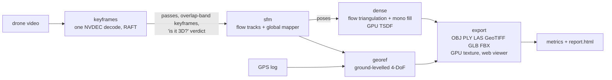

# Single-Pass Drone Video → Complete 3D Model, on one GPU

[](LICENSE)
[](.python-version)
[](https://docs.astral.sh/uv/)
[](docs/problem-statement.md)

One drone video in — one pass, no flight planning, no ground control — and out
come a **textured 3D mesh** and a **dense point cloud** of the visible scene,
**georeferenced and metric** when a GPS log is supplied, in the formats Smart
India Hackathon problem statement **26158** (NTRO) asks for: **OBJ, PLY, LAS,
GeoTIFF, glTF/GLB and FBX**, with a **web viewer** that measures distances.

Everything runs on one GPU: NVDEC decoding, RAFT optical flow, structure from
motion built on that flow instead of SIFT, flow triangulation completed by a
monocular depth prior, GPU TSDF fusion and GPU texture baking.

## Two profiles

| | `configs/fast.yaml` — the deliverable | `configs/accurate.yaml` / `default.yaml` |
|---|---|---|
| Output | textured mesh + point cloud, DSM + orthophoto | 3D Gaussian Splatting model + mesh from it |
| SfM | RAFT flow tracks → pycolmap global mapper | spirula-studio GPU SfM (SIFT) |
| Geometry | flow triangulation + Depth Anything V2 fill → GPU TSDF | depth-supervised 3DGS (Marigold v2 prior), spirula mesher |
| Time | within or near the official budget (below) | hours per clip |
| Needs | this repository, ffmpeg with NVDEC | + spirula-studio build, Marigold v2 weights |

## How the fast profile works



1. **One decode.** NVDEC decodes the video once; the same ffmpeg process
   delivers 640 px analysis frames and 1920 px keyframe candidates (stacked in
   one frame), colour conversion runs on the GPU, candidates are nvJPEG-encoded
   as they stream. A 12-pair motion probe lowers the analysis rate for slow
   footage (the sample videos move 0.5–3 px per step at 12 fps).
2. **Passes and keyframes by overlap, not by clock.** Cuts, fades and dissolves
   split edited footage into passes (flow forward–backward consistency collapses);
   letterbox bars are cropped. A grid chained through the flow from keyframe *K*
   picks the next keyframe as the sharpest frame whose co-visibility with *K*
   lies in [0.75, 0.85] — similar enough to match, different enough to see depth.
3. **Is it really 3D?** Residual parallax after the best homography, measured
   with direct keyframe-pair flow and normalised by the noise floor, flags a
   drone yawing on the spot or a planar/far-away scene as `degenerate`.
4. **SfM from flow.** Direct RAFT flow from each keyframe to its next three gives
   sub-pixel multi-view tracks (each step checked against the longer direct
   flows, so drift cannot accumulate); pycolmap's global mapper (GLOMAP) maps
   them. No SIFT: on the Jal Mahal orbit the poses agree with SIFT SfM to 0.2 %
   of the flight extent and 0.28° in rotation.
5. **Dense geometry.** With the poses, every consistent flow vector to
   neighbours 2–12 keyframes away is triangulated (a single pass is 0.1–1°
   between nearby keyframes, so wide baselines matter); Depth Anything V2,
   calibrated per image to that triangulated depth, fills what flow cannot see
   (far field, water) — never the sky (zero disparity). A GPU TSDF with a wide
   truncation band fuses all views into a coloured mesh and point cloud.
6. **Georeferencing.** A single pass is nearly a straight line, so aligning
   camera centres to GPS leaves the roll about it undetermined; the model is
   levelled on its RANSAC ground plane and only yaw, scale and translation are
   fitted. LAS and GeoTIFF are written in UTM with the EPSG code.
7. **Export.** Full-density PLY; a viewable copy (≤ 600k triangles) as GLB,
   textured OBJ/GLB (atlas baked on the GPU from the 1920 px keyframes: each
   triangle from the view that sees it best, unoccluded) and FBX; LAS; DSM and
   orthophoto GeoTIFFs; a self-contained three.js viewer.

## Measured

<!-- measured:start -->
<!-- measured:end -->

Georeferencing, with synthetic GPS (1.5 m horizontal / 3 m vertical noise) on
the real Jal Mahal models ([`experiments/georef_e2e.py`](experiments/georef_e2e.py)):
rotation error 0.02–0.36°, scale error ≤ 0.5 %, mesh error **0.43 m and 0.86 m
(median) within 100 m of the flight track**, growing with distance (7–18 m for
geometry 300 m+ away across the lake). None of the public sample videos has a
flight log; a real one has not been tested yet.

## Quickstart

Requires an NVIDIA GPU (tested on A100, driver 610 / CUDA 13.x) and `uv`.

```bash
git clone --recurse-submodules https://github.com/Shuvam-Banerji-Seal/SIH_2D-to-3D
cd SIH_2D-to-3D
uv sync --all-extras                       # Python 3.14, torch 2.14 + CUDA 13.2
tools/setup_third_party.sh                 # RoMa v2 (merges passes) and MoGe (optional prior), from source
# a static ffmpeg >= 5 with NVDEC is picked up from .tools/ffmpeg (or $DRONE3D_FFMPEG)
# optional, for FBX: mamba create -p .tools/assimp -c conda-forge assimp && tools/build_meshconv.sh
uv run drone3d doctor

uv run drone3d run --config configs/fast.yaml \
    --set ingest.video=/data/pass.mp4 \
    --set ingest.telemetry=/data/pass.SRT      # optional: DJI SRT, CSV, GPX or JSON
uv run drone3d view outputs/fast               # http://127.0.0.1:8765
uv run drone3d ui                              # or everything from the browser: http://127.0.0.1:8080
```

RAFT and Depth Anything V2 weights download on first use (set `HF_HUB_CACHE` /
`TORCH_HOME` to choose where). Any key can be overridden with
`--set section.key=value`; any stage re-run on an existing run directory with
`--run-dir R --stages dense,export`. Sample footage: `tools/fetch_datasets.sh`
downloads the fifteen public clips listed in [`resources.md`](resources.md).

## The console, the warm engine and live footage

```bash
uv run drone3d ui                 # http://127.0.0.1:8080 -- starts and supervises the engine on demand
uv run drone3d engine --warm raft_large,depth_anything_v2_large   # or run the engine yourself
```

- **Console** — the engine and every model it holds (load / unload / warm for a
  profile), NVML gauges and ten-minute charts, the processes on the GPU with
  ours marked, a capability check of the machine (CUDA, NVDEC/NVENC, nvJPEG,
  Open3D CUDA, GLOMAP, splat trainer, FBX writer, weights), work in flight.
- **Build** — a video from the library or an upload (drop or pick a file;
  progress and time left are shown, and an upload never replaces a file of the
  same name that earlier runs use), a flight log, a profile, a resolution
  preset (draft / high / ultra), module switches (depth fill, photo texture,
  Gaussian splats, georeference, LAS, GeoTIFF, FBX, STL, Blender) and every
  option of the configuration, generated from the config dataclasses.
- **Live** — an RTSP / RTMP / SRT / UDP / HLS / HTTP stream, a V4L2 camera, or
  a recorded flight replayed at its frame rate. ffmpeg cuts it into segments at
  keyframes without re-encoding; each closed segment becomes a run on the warm
  engine, ahead of other work (Qutub Minar replayed in 30 s segments: a model
  26–38 s after each segment closed). With a flight log every segment is
  georeferenced into one ENU frame.
- **Explorer** — every product as a layer with its own switch: the textured
  mesh (texture / shaded / wireframe), the dense cloud, the Gaussian splats, the
  flight path with camera frusta, the keyframe photos and their depth maps
  placed where they were taken, the source video picture-in-picture, a grid,
  and *focus subject* (on by default where the flight circles something): a
  box a camera distance around the point the optical axes converge on, which
  hides the far field -- most of a merged model's triangles, and its least
  accurate -- in the viewer only; the files keep all of it.
  Orbit, fly (<kbd>W A S D Q E</kbd>) or *follow flight* along the drone's own
  path and view (the video follows); zoom, fit, all models; click a keyframe
  to look through it with its photo over the model; 0.5–2× render resolution;
  measuring; screenshots. The run page adds the keyframe filmstrip, a photo /
  depth comparison slider and every deliverable (OBJ, PLY, GLB, FBX, STL,
  .blend, LAS, GeoTIFF). The same explorer ships with every export
  (`export/index.html`).

The **engine** (`drone3d engine`) is a resident GPU process: RAFT and Depth
Anything stay loaded and RAFT's CUDA graphs are captured once per frame size
(the three most recent kept, so memory stays flat over many videos). It loads a model
only if the GPU has its footprint plus a reserve free at that moment (other
users' processes included), never unloads one a run is using, fits
memory-hungry settings (TSDF budget, flow batch, texture size) to the free
memory before each run, and after a sticky CUDA fault saves its queue and
exits so the console restarts it with the same models warm. Warm runs save
~5 s per video (Jal Mahal: 106 s warm vs 109 s cold, same conditions); the
point is an always-ready engine and low latency for live segments.

## Outputs (fast profile)

```
outputs/<run>/
├── export/
│   ├── index.html, scene.json, vendor/   web viewer (drone3d view <run>)
│   └── model_N/
│       ├── mesh.ply                      full-density mesh, vertex colours
│       ├── mesh.glb                      viewable copy (<= 600k triangles)
│       ├── mesh_textured.{glb,obj,mtl}   textured from the keyframes (+ _albedo.jpg)
│       ├── mesh.fbx                      textured, via assimp
│       ├── points.{ply,las}              dense point cloud (LAS in UTM + EPSG when georeferenced)
│       ├── splats.splat                  Gaussian splats for the web (with the splat stage)
│       └── dsm.tif, ortho.tif            GeoTIFF surface model and orthophoto
│   └── generated/object.glb              generated object (TRELLIS.2, on request; not a measurement)
├── dense/model_N/depth/*.jpg             fused depth per keyframe (turbo; black = no depth / sky)
├── dataset/images/pass_NN/*.jpg          keyframes (1920 px)
├── dataset/sparse/N/                     COLMAP models, one per pass
├── georef/                               transforms, ENU sparse clouds, camera_track.geojson
├── keyframes/keyframe_timeline.png       passes, overlap and verdicts along the video
├── */result.json, */gpu_timeline.json    per-stage results and GPU telemetry
└── metrics/metrics.json                  incl. "processing": seconds per stage vs the budget
```

## Generated object (TRELLIS.2)

The measured model is only as complete as the flight. For a finished run, **Generate object** in
the run page's model catalog (or `drone3d generate outputs/<run>`) runs
[TRELLIS.2](https://huggingface.co/microsoft/TRELLIS.2-4B) on the keyframe that shows the subject
whole: the one looking at the point where the optical axes converge, from farthest away. The
result, `export/generated/object.glb`, is complete from every side, but it is **generated, not
measured**: unseen sides are invented and the scale is arbitrary, so it is listed apart and never
enters the deliverables or the metrics. Before generating, the RMBG-2.0 cut-out keeps only its
largest part (an opening at 3.5 % of the diagonal cut the block of houses Colosseum's cut-out
dragged along). Conditioning on several keyframes from different sides, averaged per flow step,
stacked several rings on each other -- TRELLIS.2 generates in a frame tied to the input view -- so
it uses one. It runs in its own environment (`tools/setup_trellis2.sh`; torch 2.7 and its CUDA
extensions): about 2.5 min to load, 80 s to generate at 1024^3 and 80 s to bake the GLB on the
A100, 8 GB of GPU memory at most.

## The accurate profile (3D Gaussian Splatting)

`configs/default.yaml` keeps the first pipeline: spirula-studio GPU SfM (213/213
Jal Mahal keyframes, 0.79 px), Marigold v2 depth calibrated per image to the SfM
tie points (monotone map; held-out AbsRel 2.7 %), depth-supervised 3DGS (held-out
PSNR 35.0 dB on the largest model), meshes from the splats and gsplat fly-through
renders. It needs the spirula-studio build and the Marigold v2 / Qwen-Image-Edit
weights (see [`docs/architecture.md`](docs/architecture.md)) and takes hours per
clip. The method and its experiments are in [`paper/`](paper/).

## Repository

```
src/drone3d/
├── io/nvdec.py         NVDEC decode (analysis + keyframe candidates in one pass), GPU colour, nvJPEG
├── io/telemetry.py     CSV / DJI SRT / GPX / JSON flight logs
├── keyframes/          RAFT flow (CUDA Graphs), pass segmentation, overlap-band selection, 3D verdict
├── fastsfm/            flow tracks, pycolmap mapping, flow triangulation, mono fill, TSDF (fast profile)
├── export/             OBJ/PLY/GLB/FBX/LAS/GeoTIFF writers, GPU texture baking, web splats
├── engine/             warm engine: model cache, job queue, live segments, HTTP control API
├── app/                the console: FastAPI server, engine supervisor, static front end (js/, fonts/)
├── viewer/static/      explorer.js + standalone viewer; three.js and Spark (vendored, MIT)
├── depth/, splat/      Marigold v2 and spirula-studio wrappers (accurate profile)
├── generate.py         TRELLIS.2 generated object from a run's subject keyframe (subprocess)
├── geo/                WGS84/ENU, Umeyama, ground-levelled 4-DoF georeferencing
├── gpu/               NVML sampler per stage (records GPU sharing) and snapshots for the console
├── pipeline.py, config.py, cli.py
experiments/            scripts behind every number above and in the paper
paper/, promo/          LaTeX paper; code-drawn promo film + compositor
third_party/            spirula-studio, marigold-v2, javascript-animation-skills (submodules); RoMaV2,
                        MoGe (tools/setup_third_party.sh), TRELLIS.2 (tools/setup_trellis2.sh), priors/
                        (tools/setup_priors.sh, for experiments/prior_bench.py)
tools/                  dataset download, synthetic control clip, FBX converter, record_ui (console tour)
```

## Limitations

Completeness is measured against what the camera saw: surfaces the single
pass never faced cannot be reconstructed; the far field beyond three times the
triangulated range is left empty rather than guessed (the depth prior is
47–87 % off out there); shots of three or four keyframes, as in montage edits,
get no depth; and water reflections become mirrored geometry below the
surface. Georeferencing is verified with synthetic GPS only. Dynamic objects
are not masked. Fast FPV footage needs ~10 keyframes per second and clips
under half a minute carry fixed per-run costs, so both exceed a budget
proportional to their length. Live segments cut a camera move at their
boundary.

## Licences

This repository is GPL-2.0-only. spirula-studio (GPL-3.0) is used as a separate
program through its command line; three.js is MIT. **Depth Anything V2 Large,
the fast profile's default depth prior, is CC-BY-NC-4.0 (non-commercial)**; the
Small model is Apache-2.0 (`--set dense.mono_model=depth-anything/Depth-Anything-V2-Small-hf`),
and MoGe-3 ViT-L is MIT (`--set dense.mono_model=Ruicheng/moge-3-vitl`: half the
far-field extrapolation error, about seven times the GPU time).
Marigold v2 weights are Apache-2.0 on top of Qwen-Image-Edit-2509 (its own
licence). The optional generated object uses TRELLIS.2 (MIT), RMBG-2.0 (Bria's
licence, non-commercial) and DINOv3 (Meta's DINOv3 licence); RoMa v2, which merges
the passes, is MIT. The sample videos are third-party YouTube content used for research
only and are not redistributed.
