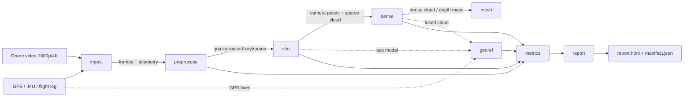

# Architecture

## Pipeline overview



Every stage communicates through files inside a single run directory, so stages
can be re-run independently (`drone3d run --stages mesh`).

## Run directory layout

```
outputs/<run_name>_<UTC timestamp>/
├── manifest.json                  # config + stage results + metrics
├── report.html                    # self-contained report (embedded previews)
├── logs/run.log
├── frames/                        # raw sampled frames
├── frames_selected/               # quality-ranked keyframes (+ masks/)
├── ingest/                        # frames.csv, video_info.json, telemetry_summary.json
├── preprocess/                    # selected_frames.csv, selection_summary.json
├── sfm/                           # database.db, sparse model, sparse.ply, result.json
├── dense/                         # fused.ply or depth/*.npy, result.json
├── mesh/                          # mesh-*.ply / textured/*.obj, result.json
├── georef/                        # georeferenced_*.ply, camera_track.geojson, result.json
└── metrics/                       # metrics.json
```

## Module map

| Module | Responsibility | Backends / deps |
| --- | --- | --- |
| `drone3d.config` | Typed YAML config, dotted `--set` overrides, validation | PyYAML |
| `drone3d.io` | Video probing, deterministic sampling, telemetry parsers | OpenCV |
| `drone3d.preprocess` | Quality scoring, keyframe selection, deblur, stabilization, dynamic masks | OpenCV; optional Ultralytics |
| `drone3d.sfm` | SfM backends + feature/frame-graph diagnostics | COLMAP; OpenCV |
| `drone3d.dense` | Dense MVS and monocular depth | COLMAP; optional torch/transformers |
| `drone3d.mesh` | Poisson/Delaunay meshing, texturing, export | COLMAP; optional Open3D/Trimesh |
| `drone3d.geo` | WGS84↔ECEF↔ENU, similarity georeferencing, camera geometry | NumPy |
| `drone3d.metrics` | Cloud bounds, density, Chamfer/completeness, scale check | NumPy |
| `drone3d.report` | Contact sheet + standalone HTML report | OpenCV |
| `drone3d.pipeline` | Stage orchestration, artifact contracts, manifest | - |
| `drone3d.cli` | `run`, `init-config`, `doctor`, `version` | - |

## Design decisions

- **Artifact-based stages.** Each stage reads its predecessors' JSON artifacts
  and writes its own. This keeps stages resumable, testable and swappable, and
  makes the run directory self-describing for judges/operators.
- **Graceful degradation.** Missing optional backends (no COLMAP, no GPU) mark a
  stage `skipped` with an actionable message instead of failing the run, so
  ingest/preprocess/metrics/report always produce evidence.
- **Quality-first frame selection.** More candidates are extracted than needed
  (`preprocess.oversample`) and ranked by a composite of sharpness, exposure and
  contrast before reconstruction — directly targeting single-pass motion blur.
- **Georeferencing by camera centers.** COLMAP camera centers are matched to
  per-frame GPS fixes and a robust similarity transform (Umeyama) is fitted,
  yielding metric scale and a reported horizontal/vertical RMSE without GCPs.
- **uv-managed environment.** Single `pyproject.toml` with PEP 735 dependency
  groups and a committed `uv.lock` for reproducible hackathon judging.

## Optional dependencies

| Extra | Enables | Install |
| --- | --- | --- |
| `ai` | Monocular depth (Depth Anything V2), YOLO dynamic masks | `uv sync --extra ai` |
| `sfm` | pycolmap in-process backend | `uv sync --extra sfm` |
| `mesh` | Open3D Poisson meshing, Trimesh export/decimation | `uv sync --extra mesh` |
| `geo` | pyproj/rasterio/laspy declared but not yet used by the code | `uv sync --extra geo` |
| `api` | FastAPI service layer (planned) | `uv sync --extra api` |

External binaries: COLMAP (`colmap`) for SfM/MVS/meshing. Check with
`uv run drone3d doctor`.
